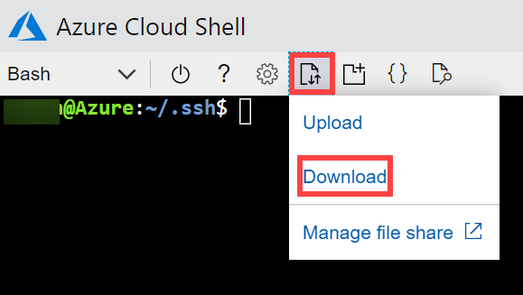
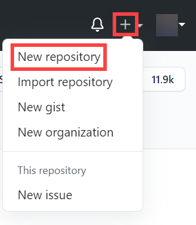
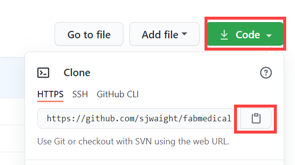

![Microsoft Cloud Workshops][logo]

<div class="MCWHeader1">
Cloud-native applications
</div>

<div class="MCWHeader2">
Before the hands-on lab setup guide
</div>

<div class="MCWHeader3">
January 2021
</div>

Information in this document, including URL and other Internet Web site references, is subject to change without notice. Unless otherwise noted, the example companies, organizations, products, domain names, e-mail addresses, logos, people, places, and events depicted herein are fictitious, and no association with any real company, organization, product, domain name, e-mail address, logo, person, place or event is intended or should be inferred. Complying with all applicable copyright laws is the responsibility of the user. Without limiting the rights under copyright, no part of this document may be reproduced, stored in or introduced into a retrieval system, or transmitted in any form or by any means (electronic, mechanical, photocopying, recording, or otherwise), or for any purpose, without the express written permission of Microsoft Corporation.

Microsoft may have patents, patent applications, trademarks, copyrights, or other intellectual property rights covering subject matter in this document. Except as expressly provided in any written license agreement from Microsoft, the furnishing of this document does not give you any license to these patents, trademarks, copyrights, or other intellectual property.

The names of manufacturers, products, or URLs are provided for informational purposes only and Microsoft makes no representations and warranties, either expressed, implied, or statutory, regarding these manufacturers or the use of the products with any Microsoft technologies. The inclusion of a manufacturer or product does not imply endorsement of Microsoft of the manufacturer or product. Links may be provided to third party sites. Such sites are not under the control of Microsoft and Microsoft is not responsible for the contents of any linked site or any link contained in a linked site, or any changes or updates to such sites. Microsoft is not responsible for webcasting or any other form of transmission received from any linked site. Microsoft is providing these links to you only as a convenience, and the inclusion of any link does not imply endorsement of Microsoft of the site or the products contained therein.

© 2020 Microsoft Corporation. All rights reserved.

**Contents**

<!-- TOC -->

- [Cloud-native applications before the hands-on lab setup guide](#cloud-native-applications-before-the-hands-on-lab-setup-guide)
  - [Requirements](#requirements)
  - [Before the hands-on lab](#before-the-hands-on-lab)
    - [Task 1: Setup Azure Cloud Shell](#task-1-setup-azure-cloud-shell)
    - [Task 2: Clone Starter Files](#task-2-clone-starter-files)
    - [Task 3: Create Azure Resource Group](#task-3-create-azure-resource-group)
    - [Task 4: Create an SSH key](#task-4-create-an-ssh-key)
    - [Task 5: Create a Service Principal](#task-5-create-a-service-principal)
    - [Task 6: Deploy ARM Template](#task-6-deploy-arm-template)
    - [Task 7: Create a GitHub repository](#task-7-create-a-github-repository)
    - [Task 8: Clone Repositories to the Build Agent](#task-8-clone-repositories-to-the-build-agent)
    - [Task 9: Stop Build Agent and AKS Cluster](#task-9-stop-build-agent-and-aks-cluster)
    - [Task 10: Optional - Setup Visual Studio Code Remote Development](#task-10-optional---setup-visual-studio-code-remote-development)

<!-- /TOC -->

# Cloud-native applications before the hands-on lab setup guide

## Requirements

1. Microsoft Azure subscription must be pay-as-you-go, MSDN or an Azure Pass.

   - Trial Azure Subscriptions will _not_ work.

   - To complete this lab setup (including [Task 5: Create a Service Principal](#Task-5-Create-a-Service-Principal)) ensure your account includes the following:

     - Has the [Owner](https://docs.microsoft.com/azure/role-based-access-control/built-in-roles#owner) built-in role for the subscription you use.

     - Is a [Member](https://docs.microsoft.com/azure/active-directory/fundamentals/users-default-permissions#member-and-guest-users) user in the Azure AD tenant you use. (Guest users will not have the necessary permissions.)

     > **Note** If you do not meet these requirements, ask another member user with subscription owner rights to login to the portal and execute the task to create the service principal.

   - You must have enough cores available in your subscription to create the build agent and Azure Kubernetes Service cluster in [Task 6: Deploy ARM Template](#Task-6-Deploy-ARM-Template). You'll need eight cores if following the exact instructions in the lab, more if you choose additional agents or larger VM sizes. Execute the steps required before the lab to see if you need to request more cores in your sub.

2. A free account on [GitHub](https://github.com/).

3. Local machine or a virtual machine configured with:

   - A browser, preferably Chrome for consistency with the lab implementation tests.

4. You will be asked to install other tools throughout the exercises.

## Before the hands-on lab

**Duration**: 60 minutes

You should follow all of the steps provided in this section _before_ taking part in the hands-on lab ahead of time as some of these steps take time.

### Task 1: Setup Azure Cloud Shell

1. Open Azure Cloud Shell by selecting the cloud shell icon in the menu bar in the Azure Portal or by navigating to https://shell.azure.com/.

   

2. If prompted, select the right Azure Subscription and create a Storage Account.

3. Choose **Bash** if prompted or use the dropdown at the top left of the shell menu bar to choose **Bash** (as shown). If prompted, select **Confirm**.

   

3. You should make sure to set your default subscription correctly. To view your current subscription type:

   ```bash
   az account show
   ```

   

4. To set your default subscription to something other than the current selection, type the following, replacing {id} with the desired subscription id value:

   ```bash
   az account set --subscription {id}
   ```

> **Note**: To list all of your subscriptions, type:

   ```bash
   az account list
   ```

   

### Task 2: Clone Starter Files

In this task, you use `git` to clone the lab content to your cloud shell so that the lab starter files will be available.

> **Note**: If you don't have a cloud shell available, refer back to [Task 1: Setup Azure Cloud Shell](#task-1-setup-azure-cloud-shell).

1. Type the following command and press `<ENTER>`:

   ```bash
   git clone https://github.com/sjwaight/MCW-Cloud-native-applications.git
   ```

   > **Note**: If you do not have enough free space, you may need to remove extra files from your cloud shell environment.  Try running `azcopy jobs clean` to remove any `azcopy` jobs and data you do not need.

2. The lab files are cloned locally.

   

3. We do not need the `.git` folder, and later steps will be less complex if we remove it. Run this command:

   ```bash
   rm -rf MCW-Cloud-native-applications/.git
   ```

### Task 3: Create Azure Resource Group

Create an Azure Resource Group to hold most of the resources that you create in this hands-on lab. This approach makes it easier to clean up later.

1. In your Cloud Shell window, you type a command similar to the following command, be sure to replace the tokens:

   > **Note**: If you don't have a cloud shell available, refer back to [Task 1: Setup Azure Cloud Shell](#task-1-setup-azure-cloud-shell).

   ```bash
   az group create -l '[LOCATION]' -n 'fabmedical-[SUFFIX]'
   ```

   - **Suffix:** Throughout the lab, [SUFFIX] should be used to make resources unique, like your email prefix or your first initial and last name.

   - **Location:** Choose a Region where Azure Container Registry is available. You can find this [list online](https://azure.microsoft.com/global-infrastructure/services/?products=container-registry&regions=us-east,us-east-2,us-central,us-north-central,us-south-central,us-west-central,us-west,us-west-2,canada-east,canada-central,south-africa-north,south-africa-west,asia-pacific-east,asia-pacific-southeast,australia-central,australia-central-2,australia-east,australia-southeast,usgov-non-regional,us-dod-central,us-dod-east,usgov-arizona,usgov-texas,usgov-virginia,brazil-south,brazil-southeast,china-non-regional,china-east,china-east-2,china-north,china-north-2,europe-north,europe-west,france-central,france-south,germany-non-regional,germany-central,germany-north,germany-northeast,germany-west-central,united-kingdom-south,united-kingdom-west,uae-central,uae-north,switzerland-north,switzerland-west,norway-east,norway-west,korea-central,korea-south,japan-east,japan-west,central-india,south-india,west-india). Use the same Region for all resources you create for this workshop.

   Example:

   ```bash
   az group create -l 'west us' -n 'fabmedical-sol'
   ```

2. When this completes, the Azure Portal shows your Resource Group.

   

### Task 4: Create an SSH key

You create VMs during the upcoming exercises. In this section, you create an SSH key to access the VMs securely.

1. From the cloud shell command line, enter the following command to ensure that a directory for the SSH keys exists. You can ignore any errors you see in the output.

   > **Note**: If you don't have a Cloud Shell available, refer back to [Task 1: Setup Azure Cloud Shell](#task-1-setup-azure-cloud-shell).

   ```bash
   mkdir .ssh
   ```

2. From the cloud shell command line, enter the following command to generate an SSH key pair. You can replace `admin` with your preferred name or handle.

   ```bash
   ssh-keygen -t RSA -b 2048 -C admin@fabmedical
   ```

3. When asked to save the generated key to a file, enter `.ssh/fabmedical` for the name.

4. Enter a passphrase when prompted, and **don't forget it**!

5. Because you entered `.ssh/fabmedical` the ssh-keygen generates the file in the `.ssh` folder in your user folder, where the cloud shell opens by default.

   

6. From the cloud shell command line, enter the following command to output the public key content. Copy this information to use later.

    ```bash
    cat .ssh/fabmedical.pub
    ```

7. Keep this cloud shell open and remain in the default directory. You will use this shell in later tasks.

    

8. If you wish to SSH from other machines like your local workstation then you can copy the SSH keys from Cloud Shell and add them locally. In Cloud Shell select the **Upload/Download files** button and select **Download**. Download the `fabmedical` and `fabmedical.pub` files and copy them to your local .ssh folder. 

    

>**Note:** SSH clients are available on all major operating systems. Recent Windows 10 releases have an optional feature that installs an OpenSSH client. See the [Visual Studio Code documentation](https://code.visualstudio.com/docs/remote/troubleshooting#_installing-a-supported-ssh-client) for the best option.

### Task 5: Create a Service Principal

Azure Kubernetes Service (AKS) uses an Azure Active Directory (AAD) Service Principal to interact with Azure APIs. The Service Principal is needed to dynamically manage resources such as user-defined routes and the Layer 4 Azure Load Balancer. The easiest way to set up the service principal is by using the Azure Cloud Shell and the Azure Command Line Interface (CLI).

> **Note**: To complete this task, ensure your account is an [Owner](https://docs.microsoft.com/azure/role-based-access-control/built-in-roles#owner) built-in role for the subscription you use and is a [Member](https://docs.microsoft.com/azure/active-directory/fundamentals/users-default-permissions#member-and-guest-users) user in the Azure AD tenant you use. You may have trouble creating a service principal if you do not meet these requirements.

1. To create a Service Principal, type the following command in the cloud shell command line, replacing {id} with your subscription identifier, and replacing suffix with your chosen suffix to make the name unique:

   > **Note**: If you don't have a Cloud Shell available, refer back to [Task 1: Setup Azure Cloud Shell](#task-1-setup-azure-cloud-shell).

   ```bash
   az ad sp create-for-rbac --role="Contributor" --scopes="/subscriptions/{id}" --name="http://fabmedical-sp-{SUFFIX}"
   ```

2. The command produces output like this. Copy this information to use later.

   

3. To get the Service Principal object id, type the following command, replacing {appId} with your service principal appId:

   ```bash
   az ad sp show --id {appId} --query "{objectId:@.objectId}"
   ```

4. The command produces output like this. Copy this information to use later.

   

### Task 6: Deploy ARM Template

In this section, you configure and execute an ARM template that creates all the resources that you need throughout the exercisesin the lab.

1. In Azure Cloud Shell, switch to the ARM template directory:

   > **Note**: If you don't have a cloud shell available, refer back to [Task 1: Setup Azure Cloud Shell](#task-1-setup-azure-cloud-shell).

   ```bash
   cd MCW-Cloud-native-applications/Hands-on-lab/arm/
   ```

2. Open the azuredeploy.parameters.json file for editing using Azure Cloud Shell editor.

   ```bash
   code azuredeploy.parameters.json
   ```

   

3. Update the values for the various keys so that they match your environment:

   - **Suffix**: Enter a shortened version of your SUFFIX with a max of 3 chars.
   - **VirtualMachineAdminUsernameLinux**: The Linux Build Agent VM admin username (example: `"adminfabmedical"`).
   - **VirtualMachineAdminPublicKeyLinux**: The Linux Build Agent VM admin ssh public key. You find this value in the `.ssh/fabmedical.pub` file created previously (example: `"ssh-rsa AAAAB3N(...)vPiybQV admin@fabmedical"`).
   - **CosmosLocation**: The primary location of the Azure Cosmos DB. Use the same location as the resource group previously created (example: `"eastus"`).
   - **CosmosLocationName**: The name of the primary location of the Azure Cosmos DB. Use the name of the same location as the resource group previously created (example: `"East US"`).
   - **CosmosPairedLocation**: The secondary location of the Azure Cosmos DB. The below link can be used to help find the Azure Region Pair for your primary location. (example: `"westus"`).
   - **CosmosPairedLocationName**: The name of the secondary location of the Azure Cosmos DB. Use the location name that matches the secondary location defined in the previous key (example: `"West US"`).

   > **Note**: A list of Azure Region Pairs can be found here: <https://docs.microsoft.com/azure/best-practices-availability-paired-regions#azure-regional-pairs>.

4. Select the **...** button and select **Save**.

   

5. Select the **...** button again and select **Close Editor**.

   

6. Create the needed resources by typing the following instruction (case sensitive), replacing {resourceGroup} with the name of the previously created resource group:

   ```bash
   az deployment group create --resource-group {resourceGroup} --template-file azuredeploy.json --parameters azuredeploy.parameters.json
   ```

   This command takes 30 to 60 minutes to deploy all lab resources. You can continue to the next task to setup GitHub while the deployment runs.

   > **Note** If you get an error about the Cosmos DB name, ensure that you typed the `ComsosLocation` and `CosmosPairedLocation` without any spaces. Re-run the above command after you have corrected the name.

### Task 7: Create a GitHub repository

FabMedical has provided starter files for you. They have taken a copy of the websites for their customer Contoso Neuro and refactored it from a single node.js site into a website with a content API that serves up the speakers and sessions. This refactored code is a starting point to validate the containerization of their websites. Use this to help them complete a POC that validates the development workflow for running the website and API as Docker containers and managing them within the Azure Kubernetes Service environment.

1. Open a web browser and navigate to https://www.github.com. Log in using your GitHub account credentials.

2. In the upper-right corner, select **+** and from the drop down select **New repository**.

    

3. On the **Create a new repository** screen, name the repository **Fabmedical** and select the **Create repository** button.

    

4. On the **Quick setup** screen, copy the **HTTPS** GitHub URL for your new repository, paste this in notepad for future use.

    

5. Open a **new** Azure Cloud Shell console.  You can do this by selecting the **Open new session** button from the first console, or navigating to https://shell.azure.com and logging in with the same lab credentials.

6. Navigate to the FabMedical source code folder and list the contents.

   ```bash
   cd ~/MCW-Cloud-native-applications/Hands-on-lab/lab-files/developer/
   ls
   ```
8. You'll see the listing includes three folders, one for the web site, another for the content API and one to initialize API data:

   ```bash
   content-api/
   content-init/
   content-web/
   ```

9. Set your username and email, which git uses for commits.

    ```bash
    git config --global user.email "you@example.com"
    git config --global user.name "Your Name"
    ```

10. Using the Cloud Shell, initialize a new git repository:

    ```bash
    git init
    git add .
    git commit -m "Initial Commit"
    ```

11. Set the remote origin to the new git repository on GitHub you just created by issuing the following command:

    ```bash
    git remote add origin https://github.com/YOURNAME/YOURREPO.git
    ```

12. Configure git CLI to cache your credentials, so that you don't have to keep re-typing them.

    ```bash
    git config --global --unset credential.helper
    git config --global credential.helper store
    ```

13. Push to the master branch by issuing the following command:

    ```bash
    git push -u origin master
    ```

    > **Note**: If you have multi-factor authentication for GitHub, you will need to create a Personal Access Token (PAT) when using the Cloud Shell. Reference the following link for help with setting up a GitHub PAT to use for authenticating `git` with your GitHub account: https://docs.github.com/en/github/authenticating-to-github/creating-a-personal-access-token.

    > **Note**: Once you have your PAT, retry the above command, use your token as the password.

14. Refresh your GitHub repository, you should now see the code published.

### Task 8: Clone Repositories to the Build Agent

In this task, you clone your newly created repository from GitHub so you can work with them on the lab VM.

> **Note:** By default Azure VM IP addresses change if they are stopped. You can reserve the IP or set a hostname to avoid issues with connections if you stop the VM.

1. Connect securely to your lab VM using SSH (replace HOST_IP_ADDRESS with IP of your VM). If prompted, enter the passphrase you used when first creating the SSH key.

   ```bash
   ssh -i .ssh/fabmedical adminfabmedical@HOST_IP_ADDRESS
   Enter passphrase for key '.ssh/fabmedical':
   ```

2. As you previously did in Cloud Shell, set your username and email which are used for git commits.

   ```bash
   git config --global user.email "you@example.com"
   git config --global user.name "Your Name"
   ```

   > **Note**: In some cases, the `root` user owns your user's `.config` folder. If this happens, run the following command to return ownership to `adminfabmedical` and then try the `git` command again:
   >
   > ```bash
   > sudo chown -R $USER:$(id -gn $USER) /home/adminfabmedical/.config
   > ```

2. Configure git CLI to cache your credentials, so that you don't have to keep re-typing them.

   ```bash
   git config --global credential.helper cache
   ```

   > **Note**: In some cases, the `root` user owns your user's `.config` folder. If this happens, run the following command to return ownership to `adminfabmedical` and then try the `git` command again:
   >
   > ```bash
   > sudo chown -R $USER:$(id -gn $USER) /home/adminfabmedical/.config
   > ```

3. On GitHub copy the Clone URL for the new repository and then use `git clone` to clone it to the VM.

    

   ```bash
   git clone <GITHUB_REPOSITORY_URL>
   ```

   > **Note**: In some cases, the `root` user owns your user's `.config` folder. If this happens, run the following command to return ownership to `adminfabmedical` and then try the `git` command again:
   >
   > ```bash
   > sudo chown -R $USER:$(id -gn $USER) /home/adminfabmedical/.config
   > ```


**You are now ready to start with the main labs!**

 - [Start Now!](HOL%20step-by-step%20-%20Cloud-native%20applications.md) 

 ***

### Task 9: Stop Build Agent and AKS Cluster

If you are setting up well in advance of your lab you may wish to stop both your Build Agent VM along with your AKS Cluster. This will remove compute charges until you restart both.

You can use the following commands at your Azure Cloud Shell commandline to achieve this. Replace {} with appropriate values based on your previous deployment.

   ```bash
   az vm deallocate --resource-group {resourceGroup} --name {buildAgentVMName}
   ```

   ```bash
   az aks stop --resource-group {resourceGroup} --name {aksClusterName}
   ```

In order to start these resources you can use the `start` command (simply replace the `stop` in the above commands).

Note that the IP addresses assigned to these two resources will change when they are started again. When stopping and AKS Cluster you will find that the Node Count drops to zero for all Node Pools.

### Task 10: Optional - Setup Visual Studio Code Remote Development

This step is not required to complete the labs, but it may make some activities easier to complete.

If you have access to a local computer with SSH installed and internet access then you can utilise Visual Studio Code's Remote Development capabilities over SSH.

As you have already setup a lab Virtual Machine that meets the specifications all you need to do is download Visual Studio Code locally and install the Remote Development extension pack.

Even if you're on a Windows or Mac you can still use this feature to access the remote Linux box for development purposes.

Please follow the official setup guide if you wish to proceed: https://code.visualstudio.com/docs/remote/ssh

[logo]: https://github.com/Microsoft/MCW-Template-Cloud-Workshop/raw/master/Media/ms-cloud-workshop.png
[portal]: https://portal.azure.com
